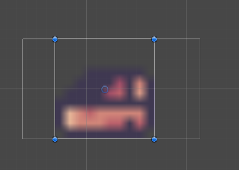
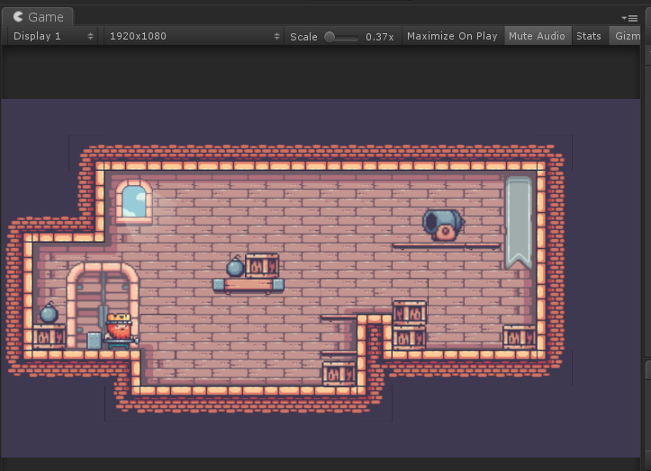
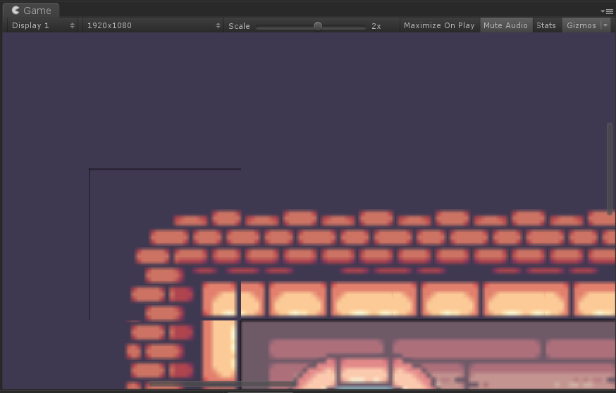
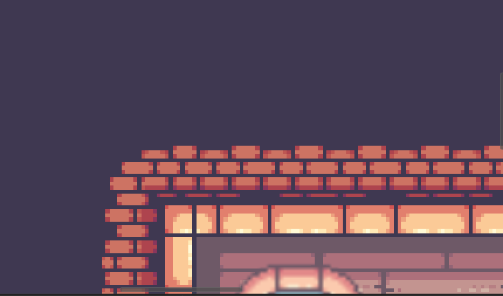

# King And Pigs

这个小游戏是我从itch.io上找到的一些2D资源拼装而成的一个2D游戏DEMO，主要的创作目的是为了学习Unity 中的TileMap和一些2D方面的技术。我会将在这个过程中学到的知识做一个记录和总结。

PS : 一些简单的操作性的东西不会记录在这里。

------

## 1.1 图像分辨率和屏幕分辨率

——图像分辨率：每英寸图片内有多少个像素点，单位为PPI(Pixels Per Inch)—像素每英寸。例如72ppi代表每英寸包含72个像素点
——屏幕分辨率：屏幕每行的像素点数*屏幕每列的像素点数。例如1280*720代表横向1280像素纵向720像素，其总数为1280*720=921600个像素

------

## 1.2 Unity 是如何决定摄像机视角大小的

### 1.2.1 正交投影的情况下

​	在正交投影的情况下，Unity 通过Camera 组件中的Size 值决定摄像机的高度占多少个Unity 单位。

**当Size 值为1 的时候表示摄像机的高度为2个Unity 单位。**

**当Size 值为0.5的时候表示摄像机的高度为1个Unity 单位。**

这样我们就可以知道当前的摄像机高度表示多少个Unity 个单位，我们可以知道所谓的**Unity 单位并不是一个固定的值，它的大小是随着屏幕分辨率的变化而变化的，它其实是一个虚拟的单位。**

那么宽度是如何变化的呢?

​	答案很简单，**相机高度/相机宽度 = 屏幕高度/屏幕宽度**。通过这个比值就可以计算出不同屏幕分辨率下相机的宽度大小。

------

### 1.2.2 透视投影的情况下

​	当在透视投影的情况下，Unity 单位就不像正交投影那样可以计算出一个像素值出来，相反这个时候Unity 单位就更多的是一个逻辑单位了(因为就算有一个物体的大小为一个Unity单位，那么根据透视的近大远小规则它大小对应的像素值随着距离的变化不是固定的)，此时这个摄像机的视角范围是按照图形学中光栅化过程来进行计算的。具体的计算过程可以参考:https://www.scratchapixel.com/

------

## 1.3 Unity 中贴图的加载  Pixels Per Unit的作用

在Unity 中我们可以指定加载的贴图的类型，然后Unity 会将贴图转化为它自己内部的一种表现形式。我们可以指定贴图加载的格式，贴图的压缩方式，以及贴图的被着色器的采样方式等等。但是有一个需要注意的点是Pixels Per Unit 这个属性，这个属性的具体意义是贴图在Unity 中世界中每一个单位有多少个像素。默认值是100.**Pixels Per Unit 的作用是决Unity的一个单位长度包含本图片多少个像素**

该值可以更改一个贴图在Unity 中表示的大小。例如当我们有一个  10*10 (总共有100个像素)贴图的时候，我们将摄像机的投影模式设置为正交投影模式，并且将摄像机的  **Size** 设置 为**0.5**  由上面可知此时摄像机的高度表示一个Unity单位,因为贴图有100个像素，而贴图的**Pixels Per Unit** 设置为100 ，100/100 = 1那么这个贴图的高度应该也是一个Unity单位，两者的高度对比如下图所示。可以看出高度是一样的。

------

## 1.4 为什么Game视图中Scale大小一般不为1呢？

这个问题如下图所示,图中的scale 为0.37，原因很简单我们游戏设置了分辨率为1920*1080 但是实际Game窗口的大小并不是1920*1080 所以在显示的时候就要将游戏画面进行一个缩放来将游戏画面放入到Game 窗口中进行显示，当我们使用一个很小的分辨率的时候scale 的值可能为1.

------

## 1.5 Game视图中显示的图块之间的缝隙问题

在制作了地图之后我发现了Game视图中的TileMap的某些图块的连接部分会产生缝隙，如下图所示。

解决方法是将对应的贴图的Filter Mode改为Point (使用点插值，而不是使用Bilinear插值或者是Trilinear插值)。估计这种情况应该是进行贴图的uv插值时候的误差导致。更改为Point插值后的效果如下所示。

------

